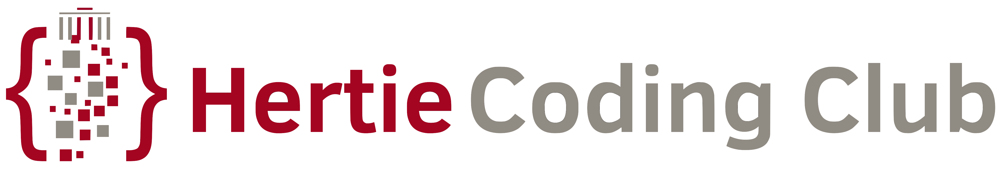
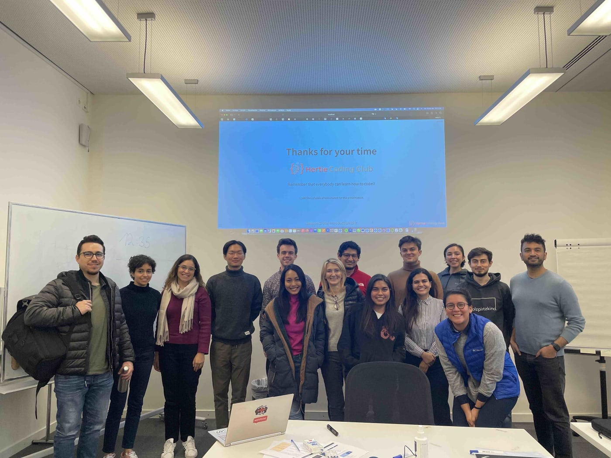
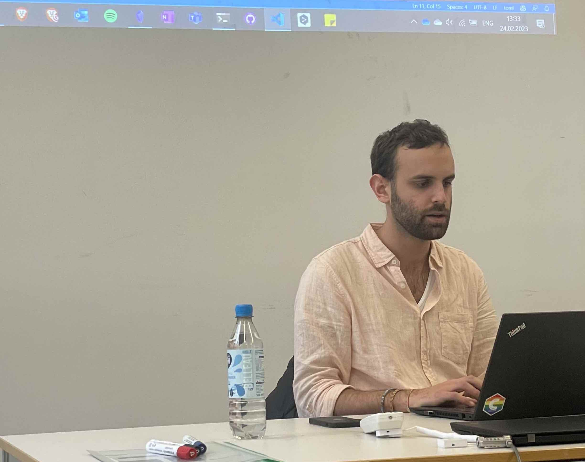

  

  

Founded in October 2022 in the vibrant city of Berlin, Germany, the Hertie Coding Club was created with the belief that coding is amazing, meaningful, well-rewarded, and easy to learn. The club aims to provide the Hertie community with a platform for learning and developing coding skills for multiple purposes.

|                               |                               |
|----------------------------------------|----------------------------------------|
|   |   |
|            |          |

